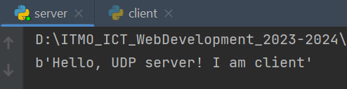
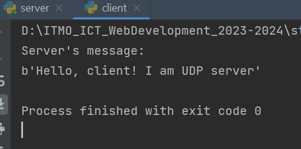

# Задание №1

> Реализовать клиентскую и серверную часть приложения. Клиент отсылает серверу
сообщение «Hello, server». Сообщение должно отразиться на стороне сервера.
Сервер в ответ отсылает клиенту сообщение «Hello, client». Сообщение должно
отобразиться у клиента.Реализовать с помощью протокола UDP.

**server.py**

```python
import socket

sock = socket.socket(socket.AF_INET, socket.SOCK_DGRAM)
sock.bind(('127.0.0.1', 9999))

while True:
    data, addr = sock.recvfrom(1024)
    print(str(data))
    message = 'Hello, client! I am UDP server'.encode('utf-8')
    sock.sendto(message, addr)
```


*Сообщение, полученное сервером*

**client.py**
```python
import socket

client_sock = socket.socket(socket.AF_INET, socket.SOCK_DGRAM)

client_message = 'Hello, UDP server! I am client'
client_sock.sendto(client_message.encode('utf-8'),('127.0.0.1', 9999))
data, addr = client_sock.recvfrom(1024)
print("Server's message:")
print(str(data))
client_sock.close()
```


*Сообщение, полученное клиентом*