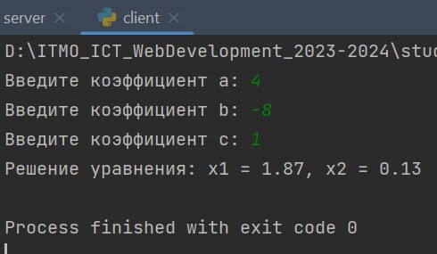
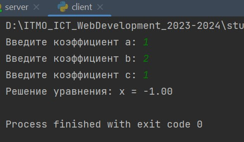
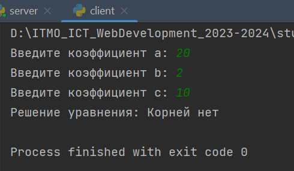

# Задание №2

> Реализовать клиентскую и серверную часть приложения. Клиент запрашивает у
сервера выполнение математической операции, параметры, которые вводятся с
клавиатуры. Сервер обрабатывает полученные данные и возвращает результат
клиенту. Решение квадратного уравнения. Реализовать с помощью протокола TCP.

**server.py**

```python
import socket
import math

def solution(a, b, c):
    discr = b ** 2 - 4 * a * c
    if discr > 0:
        x1 = (-b + math.sqrt(discr)) / (2 * a)
        x2 = (-b - math.sqrt(discr)) / (2 * a)
        x1x2 = ''.join([f'x1 = {x1:.2f}, x2 = {x2:.2f}'])
        return x1x2
    elif discr == 0:
        x = -b / (2 * a)
        return f'x = {x:.2f}'
    else:
        return 'Корней нет'

sock = socket.socket(socket.AF_INET, socket.SOCK_STREAM)
sock.bind(('127.0.0.1', 4040))
sock.listen(5)

while True:
    clientsocket, address = sock.accept()

    try:
        data = clientsocket.recv(1024)
        if not data:
            break
        a, b, c = map(int, data.decode().split(" "))
        result = solution(a, b, c)
        clientsocket.send(result.encode('utf-8'))

    except Exception as e:
        print(f'Ошибка: {e}')
    finally:
        clientsocket.close()
```

**client.py**
```python
import socket

clientsocket = socket.socket(socket.AF_INET, socket.SOCK_STREAM)
clientsocket.connect(('127.0.0.1', 4040))

try:
    a = int(input('Введите коэффициент a: '))
    b = int(input('Введите коэффициент b: '))
    c = int(input('Введите коэффициент c: '))

    data = f'{a} {b} {c}'
    clientsocket.send(data.encode('utf-8'))

    result = clientsocket.recv(1024).decode('utf-8')
    print(f'Решение уравнения: {result}')
except Exception as e:
    print(f'Ошибка: {e}')
finally:
    clientsocket.close()
```


*Решение уравнения с двумя корнями*



*Решение уравнения с одним корнем*



*Корней нет*