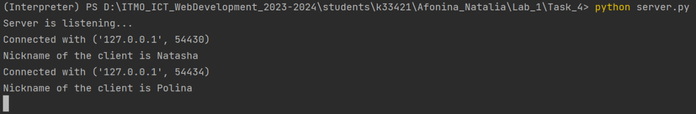
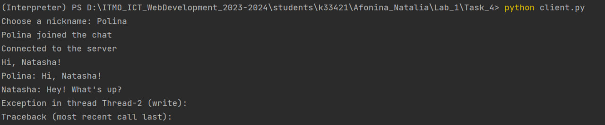
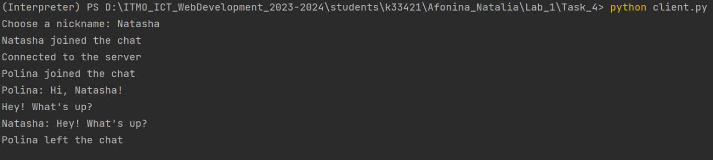

# Задание №4

> Реализовать многопользовательский чат. Реализовать с помощью протокола TCP.

**server.py**

```python
import socket
import threading

HOST = '127.0.0.1'
PORT = 8888

server = socket.socket(socket.AF_INET, socket.SOCK_STREAM)
server.bind((HOST, PORT))
server.listen()

clients = []
nicknames = []

def broadcast(message):
    for client in clients:
        client.send(message)

def handle(client):
    while True:
        try:
            message = client.recv(1024)
            broadcast(message)
        except:
            index = clients.index(client)
            clients.remove(client)
            client.close()
            nickname = nicknames[index]
            broadcast(f'{nickname} left the chat'.encode('ascii'))
            nicknames.remove(nickname)
            break

def receive():
    while True:
        client, address = server.accept()
        print(f'Connected with {str(address)}')

        client.send('NICK'.encode('ascii'))
        nickname = client.recv(1024).decode('ascii')
        nicknames.append(nickname)
        clients.append(client)

        print(f'Nickname of the client is {nickname}')
        broadcast(f'{nickname} joined the chat'.encode('ascii'))
        client.send('Connected to the server'.encode('ascii'))

        thread = threading.Thread(target=handle, args = (client,))
        thread.start()
print('Server is listening...')
receive()
```


*Сообщения сервера*

**client.py**
```python
import socket
import threading

nickname = input("Choose a nickname: ")

client = socket.socket(socket.AF_INET, socket.SOCK_STREAM)
client.connect(('127.0.0.1', 8888))


def receive():
    while True:
        try:
            message = client.recv(1024).decode('ascii')
            if message == 'NICK':
                client.send(nickname.encode('ascii'))
            else:
                print(message)
        except:
            print("An error occurred")
            client.close()
            break


def write():
    while True:
        message = f'{nickname}: {input("")}'
        client.send(message.encode('ascii'))


receive_thread = threading.Thread(target=receive)
receive_thread.start()

write_thread = threading.Thread(target=write)
write_thread.start()

```




*Сообщения клиентов*

