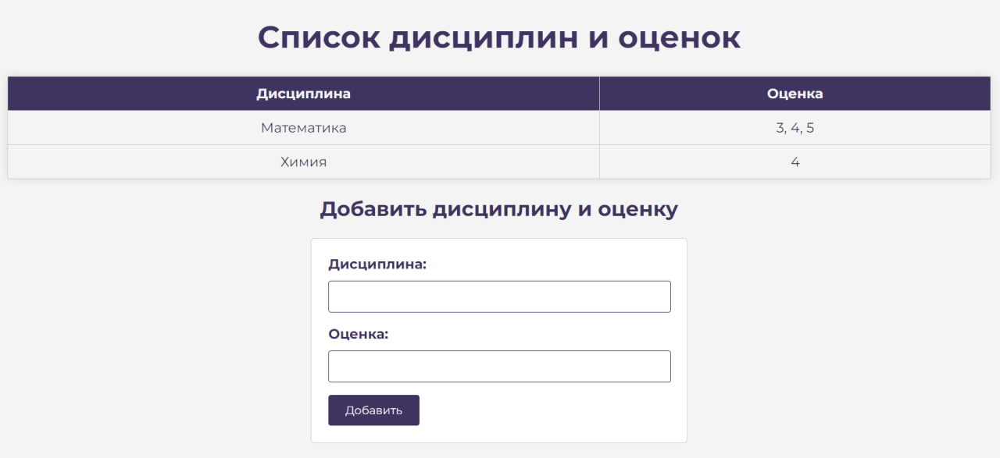
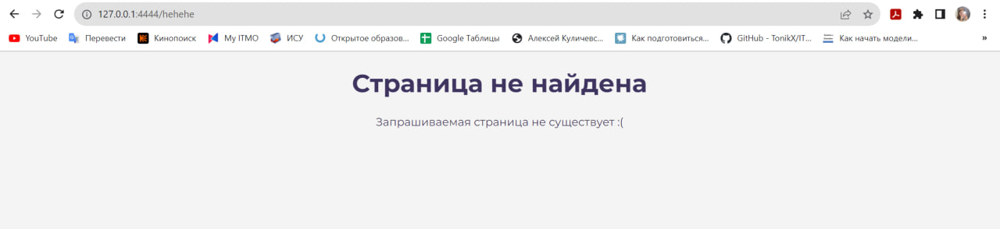

# Задание №5

> Необходимо написать простой web-сервер для обработки GET и POST http
запросов средствами Python и библиотеки socket. Сделать сервер, который может: принять и записать информацию о дисциплине и оценке по дисциплине, отдать информацию обо всех оценах по дсициплине в виде html-страницы.

**server.py**

```python
import socket
import json


class MyHTTPServer:
    def __init__(self, host, port):
        self._host = host
        self._port = port
        self.data = []

    def serve_forever(self):
        server_socket = socket.socket(socket.AF_INET, socket.SOCK_STREAM)
        try:
            server_socket.bind((self._host, self._port))
            server_socket.listen()

            while True:
                client_socket, address = server_socket.accept()
                try:
                    self.serve_client(client_socket)
                except Exception as e:
                    print('Client serving failed', e)
        finally:
            server_socket.close()

    def serve_client(self, client_socket):
        try:
            request_data = client_socket.recv(1024).decode('utf-8')
            if not request_data:
                client_socket.close()
                return
            method, url, headers = self.parse_request(request_data)
            body_data = self.parse_body(request_data)
            response = self.handle_request(method, url, headers, body_data, client_socket)

            # Only send a response if a valid response was generated
            if response is not None:
                client_socket.sendall(response.encode('utf-8'))
        except Exception as e:
            print(f"Error: {e}")
            error_message = f"Error: {e}"
            self.send_response(client_socket, error_message, status_code="500 Internal Server Error")
        finally:
            client_socket.close()

    def parse_request(self, request_data):
        lines = request_data.split('\r\n')
        request_line = lines[0].strip().split(" ")
        method = request_line[0]
        url = request_line[1]
        url_parts = url.split('?')
        path = url_parts[0]
        if len(url_parts) > 1:
            params = url_parts[1]
        else:
            params = None
        return method, path, params

    def parse_headers(self, request_data):
        lines = request_data.split('\n')
        headers = {}
        for line in lines[1:]:
            line = line.strip()
            if not line:
                break
            parts = line.split(': ')
            if len(parts) == 2:
                header_name, header_value = parts[0], parts[1]
                headers[header_name] = header_value
        return headers

    def parse_body(self, request_data):
        lines = request_data.split('\r\n')
        body = None
        for line in lines[1:]:
            line = line.strip()
            if not line:
                body = "\n".join(lines[lines.index(line) + 1:])
                break
        try:
            if body is not None:  # Добавьте проверку на None перед сериализацией
                body_data = json.loads(body)
            else:
                body_data = {}  # Если body равен None, установите его как пустой словарь
        except json.JSONDecodeError:
            body_data = {}
        return body_data

    def handle_request(self, method, url, headers, body_data, client_socket):
        if method == "GET":
            return self.handle_get_request(url, client_socket)
        elif method == "POST":
            return self.handle_post_request(url, body_data, client_socket)
        else:
            return "Method Not Allowed", 405

    def handle_get_request(self, url, client_socket):
        if url == "/":
            grades_list = ""
            for item in self.data:
                grades_list += f"<li>{item['discipline']}: {item['grade']}</li>"

            with open("index.html", encoding="utf-8") as f:
                html_file = f.read()

            html_file = html_file.replace("GRADES", grades_list)
            self.send_response(client_socket, html_file)
        else:
            with open("not_found.html", encoding="utf-8") as f:
                html_file = f.read()
            self.send_response(client_socket, html_file, status_code="404 Not Found")

    def handle_post_request(self, url, body_data, client_socket):
        if url == "/add_discipline":
            discipline = body_data.get("discipline", "")
            grade = body_data.get("grade", "")

            try:
                grade = int(grade)
                if grade < 1 or grade > 5:
                    raise ValueError("Оценка должна быть в диапазоне от 1 до 5")
            except ValueError:
                self.send_response(client_socket, "Некорректная оценка. Оценка должна быть числом от 1 до 5",
                                   status_code="400 Bad Request")
                return

            self.data.append({"discipline": discipline, "grade": grade})

            # Generate the updated HTML page with the table
            grades_list = ""
            for item in self.data:
                grades_list += f"<tr><td>{item['discipline']}</td><td>{item['grade']}</td></tr>"
            with open("index.html", encoding="utf-8") as f:
                html_file = f.read()
            html_file = html_file.replace("<!-- This is where the entered disciplines and grades will be displayed -->",
                                          grades_list)
            self.send_response(client_socket, html_file)
        else:
            with open("not_found.html", encoding="utf-8") as f:
                html_file = f.read()
            self.send_response(client_socket, html_file, status_code="404 Not Found")

    def send_response(self, client_socket, response=None, status_code="200 OK"):
        if response is None:
            response = "Internal Server Error"  # Or provide a specific error message
        response_headers = {
            "Content-Type": "text/html; charset=utf-8",
            "Connection": "close",
        }
        response_headers_raw = "".join(
            f"{k}: {v}\r\n" for k, v in response_headers.items()
        )
        client_socket.sendall(
            (
                    f"HTTP/1.1 {status_code}\r\n"
                    + response_headers_raw
                    + "\r\n"
                    + response
            ).encode("utf-8")
        )


if __name__ == '__main__':
    host = '127.0.0.1'
    port = 4444
    serv = MyHTTPServer(host, port)
    try:
        serv.serve_forever()
    except KeyboardInterrupt:
        pass
```

**index.html**
```
<!DOCTYPE html>
<html>
<head>
    <title>Список дисциплин и оценок</title>
    <style>
    body {
        background-color: #F4F4F4;
        font-family: Montserrat, sans-serif;
        text-align: center; /* Выровнять текст по центру */
        margin: 0; /* Убрать отступы по умолчанию */
        padding: 0; /* Убрать внутренние отступы по умолчанию */
    }
    h1 {
        font-family: Montserrat, sans-serif;
        font-size: 36px;
        color: #3F3460;
    }

    h2 {
    color: #3F3460;
    }

    table {
    font-family: Montserrat, sans-serif;
    margin: 0 auto; /* Центрировать таблицу по горизонтали */
    width: 80%; /* Установить ширину таблицы на 80% ширины контейнера */
    border-collapse: collapse; /* Свернуть границы ячеек таблицы */
    box-shadow: 0 0 10px rgba(0, 0, 0, 0.1); /* Добавить тень для таблицы */
    background-color: #F4F4F4;; /* Фон таблицы */
    border-radius: 5px; /* Закруглить углы таблицы */
    }

    table th,
    table td {
        padding: 10px; /* Добавить отступы для содержимого ячеек */
        text-align: center; /* Выровнять текст по центру ячеек */
        border: 1px solid #ccc; /* Добавить рамку вокруг ячеек */
        background-color: #F4F4F4; /* Фон ячеек таблицы */
        color: #3F3460;
    }

    table th {
        background-color: #3F3460; /* Фон заголовков таблицы */
        color: #F4F4F4;
    }


    form {
        font-family: Montserrat, sans-serif;
        text-align: left; /* Выровнять форму слева */
        max-width: 400px; /* Установить максимальную ширину формы */
        margin: 0 auto; /* Центрировать форму по горизонтали */
        padding: 20px; /* Добавить немного отступов для стиля */
        border: 1px solid #ccc; /* Добавить рамку для формы */
        background-color: #fff; /* Фон формы */
        border-radius: 5px; /* Закруглить углы формы */
        color: #3F3460
    }
    form label {
        font-family: Montserrat, sans-serif;
        display: block; /* Разместить метки на новой строке */
        margin-bottom: 10px; /* Отступ между метками */
        font-weight: bold; /* Усилить текст меток */
    }
    form input[type="text"],
    form input[type="number"] {
        font-family: Montserrat, sans-serif;
        color: #3F3460;
        width: 100%; /* Заполнить всю доступную ширину */
        padding: 10px 0%; /* Добавить отступы для текстовых полей */
        margin-bottom: 15px; /* Отступ между текстовыми полями */
        border: 1px solid #3F3460; /* Добавить рамку вокруг текстовых полей */
        border-radius: 3px; /* Закруглить углы текстовых полей */
    }

    form input[type="submit"] {
        font-family: Montserrat, sans-serif;
        background-color: #3F3460; /* Цвет кнопки */
        color: #F4F4F4; /* Цвет текста кнопки */
        padding: 10px 20px; /* Отступы внутри кнопки */
        border: none; /* Убрать границу кнопки */
        border-radius: 3px; /* Закруглить углы кнопки */
        cursor: pointer; /* Изменить курсор при наведении на кнопку */
    }
    </style>
</head>
<body>
    <h1>Список дисциплин и оценок</h1>
    <table border="1">
        <thead>
            <tr>
                <th>Дисциплина</th>
                <th>Оценка</th>
            </tr>
        </thead>
        <tbody id="grades-table">
            <!-- This is where the entered disciplines and grades will be displayed -->
        </tbody>
    </table>
    <h2>Добавить дисциплину и оценку</h2>
    <form id="add-form" method="POST">
        <label for="discipline">Дисциплина:</label>
        <input type="text" name="discipline" required><br>
        <label for="grade">Оценка:</label>
        <input type="number" name="grade" min="1" max="5" required><br>
        <input type="submit" value="Добавить">
    </form>

    <!-- JavaScript to handle form submission and table update -->
    <script>
        document.getElementById('add-form').addEventListener('submit', function (e) {
            e.preventDefault();
            const disciplineInput = this.querySelector('input[name="discipline"]');
            const gradeInput = this.querySelector('input[name="grade"]');
            const discipline = disciplineInput.value;
            const grade = gradeInput.value;

            // Validate the grade
            if (grade < 1 || grade > 5) {
                alert("Оценка должна быть в диапазоне от 1 до 5");
                return;
            }

            // Add the discipline and grade to the table
            const table = document.getElementById('grades-table');
            const newRow = table.insertRow(-1);
            const disciplineCell = newRow.insertCell(0);
            const gradeCell = newRow.insertCell(1);
            disciplineCell.innerHTML = discipline;
            gradeCell.innerHTML = grade;

            // Clear the form inputs
            disciplineInput.value = '';
            gradeInput.value = '';
        });
    </script>
</body>
</html>

```


*Веб-страница с информацией о дисциплине и оценках по ней*



*Веб-страница не найдена*