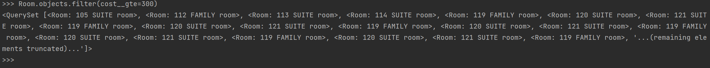
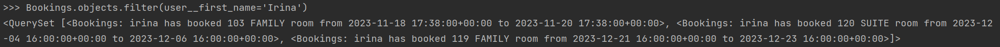
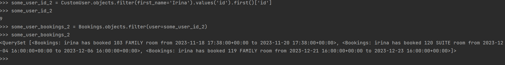
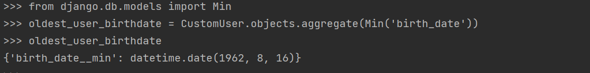
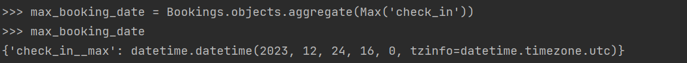
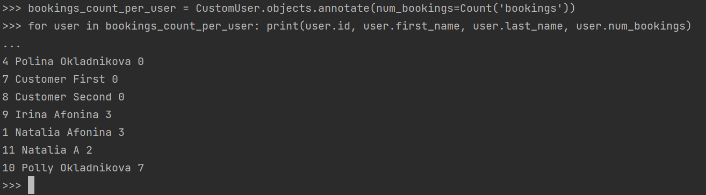
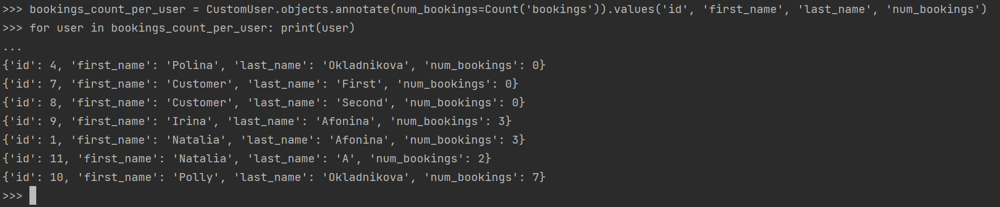
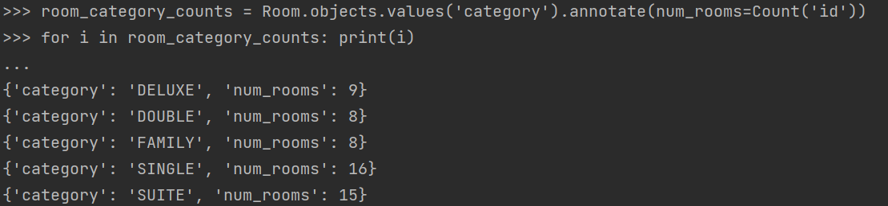
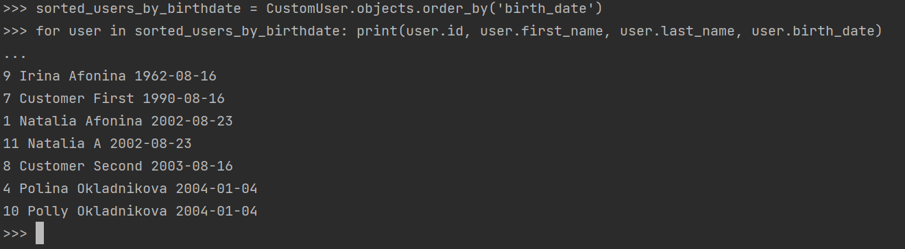
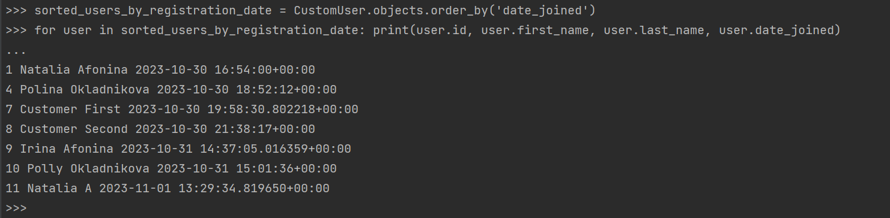

## Модели из предыдущей лабораторной работы

* Отель
* Комната
* Бронирование
* Подтверждение бронирования
* Отзыв
* CustomUser

``` python title="models.py"
from django.conf import settings
from django.contrib.auth.models import AbstractUser
from django.core.exceptions import PermissionDenied
from django.db import models
from django.urls import reverse, reverse_lazy


class Hotel(models.Model):
    name = models.CharField(max_length=50)
    owner = models.CharField(max_length=100)
    address = models.CharField(max_length=200)
    description = models.TextField()

    def __str__(self):
        return f'{self.name}'


class Room(models.Model):
    ROOM_CATEGORIES = (
        ('SINGLE', 'Single Room'),
        ('DOUBLE', 'Double Room'),
        ('FAMILY', 'Family Room'),
        ('DELUXE', 'Deluxe Room'),
        ('SUITE', 'Suite'),
    )
    number = models.IntegerField()
    category = models.CharField(max_length=6, choices=ROOM_CATEGORIES)
    beds = models.IntegerField()
    capacity = models.IntegerField()
    cost = models.DecimalField(max_digits=10, decimal_places=2)
    amenities = models.TextField()
    hotel = models.ForeignKey(Hotel, on_delete=models.CASCADE)

    def __str__(self):
        return f'{self.number} {self.category} room'


class Bookings(models.Model):
    user = models.ForeignKey(settings.AUTH_USER_MODEL, on_delete=models.CASCADE)
    room = models.ForeignKey(Room, on_delete=models.CASCADE)
    check_in = models.DateTimeField()
    check_out = models.DateTimeField()

    def __str__(self):
        return f'{self.user} has booked {self.room} from {self.check_in} to {self.check_out}'

    def get_room_category(self):
        room_categories = dict(self.room.ROOM_CATEGORIES)
        room_category = room_categories.get(self.room.category)
        return room_category

    def get_cancel_booking_url(self):
        return reverse_lazy('hotel:CancelBookingView', args=[self.pk, ])

    def edit_booking(self):
        return reverse_lazy('hotel:EditBookingView', args=[self.pk, ])

    def create_review(self, rating, text):
        review = Review.objects.create(user=self.user, room=self.room, rating=rating, text=text)
        return review


class Review(models.Model):
    user = models.ForeignKey(settings.AUTH_USER_MODEL, on_delete=models.CASCADE)
    rating = models.PositiveIntegerField(default=5, choices=[(i, i) for i in range(1, 11)])
    text = models.TextField()
    room = models.ForeignKey(Room, on_delete=models.CASCADE)
    booking = models.ForeignKey(Bookings, on_delete=models.CASCADE)

    def __str__(self):
        return f'Review by {self.user} for {self.room}'


class Confirmation(models.Model):
    booking = models.OneToOneField(Bookings, on_delete=models.CASCADE)
    is_confirmed = models.BooleanField(default=False)
    confirmed_by = models.ForeignKey(settings.AUTH_USER_MODEL, on_delete=models.CASCADE, blank=True, null=True)
    confirmation_date = models.DateTimeField(auto_now_add=True)

    def save(self, *args, **kwargs):
        if self.confirmed_by and not self.confirmed_by.is_staff:
            raise PermissionDenied("Only staff members can confirm bookings.")
        super(Confirmation, self).save(*args, **kwargs)


class CustomUser(AbstractUser):
    first_name = models.CharField(max_length=20, blank=True)
    last_name = models.CharField(max_length=20, blank=True)
    birth_date = models.DateField(blank=True, null=True)


class Profile(models.Model):
    user = models.OneToOneField(settings.AUTH_USER_MODEL, on_delete=models.CASCADE)
    birth_date = models.DateField(null=True, blank=True)
```

## Практическое задание 1
Напишите запрос на создание 6-7 новых комнат в отеле и некскольким пользователям добавьте бронь, подтвердите некоторые и добавьте на них отзывы.  

``` python
from hotel.models import *

natashashotel = Hotel.objects.get(id=1)

deluxe_room_4 = Room.objects.create(number=115, category='DELUXE', beds=1, capacity=2, cost=250, amenities='Wi-Fi, Breakfast', hotel=natashashotel)
double_room_3 = Room.objects.create(number=116, category='DOUBLE', beds=1, capacity=2, cost=200, amenities='Wi-Fi, Breakfast', hotel=natashashotel)
single_room_5 = Room.objects.create(number=117, category='SINGLE', beds=1, capacity=1, cost=100, amenities='Wi-Fi, Breakfast', hotel=natashashotel)
single_room_6 = Room.objects.create(number=118, category='SINGLE', beds=1, capacity=1, cost=100, amenities='Wi-Fi, Breakfast', hotel=natashashotel)
family_room_3 = Room.objects.create(number=119, category='FAMILY', beds=3, capacity=4, cost=300, amenities='Wi-Fi, Breakfast', hotel=natashashotel)
suite_4 = Room.objects.create(number=120, category='SUITE', beds=1, capacity=2, cost=400, amenities='Wi-Fi, Breakfast, Lounge access', hotel=natashashotel)
suite_5 = Room.objects.create(number=121, category='SUITE', beds=1, capacity=2, cost=400, amenities='Wi-Fi, Breakfast, Lounge access', hotel=natashashotel)


user_polilaa = CustomUser.objects.get(id=10)
user_natal = CustomUser.objects.get(id=1)
user_irina = CustomUser.objects.get(id=9)  

booking_user_polilaa_1 = Bookings.objects.create(user=user_polilaa, room=single_room_5, check_in='2023-11-25', check_out='2023-11-26')
booking_user_polilaa_2 = Bookings.objects.create(user=user_polilaa, room=double_room_3, check_in='2023-11-24 16:00:00', check_out='2023-11-26 16:00:00')
booking_user_natal_1 = Bookings.objects.create(user=user_natal, room=family_room_3, check_in='2023-12-01', check_out='2023-12-05')
booking_user_polilaa_3 = Bookings.objects.create(user=user_polilaa, room=suite_4, check_in='2023-11-24 16:00:00', check_out='2023-11-26 16:00:00')
booking_user_irina_1 = Bookings.objects.create(user=user_irina, room=suite_4, check_in='2023-12-04 16:00:00', check_out='2023-12-06 16:00:00')      
booking_user_irina_2 = Bookings.objects.create(user=user_irina, room=family_room_3, check_in='2023-12-21 16:00:00', check_out='2023-12-23 16:00:00')
booking_user_polilaa_4 = Bookings.objects.create(user=user_polilaa, room=single_room_6, check_in='2023-12-24 16:00:00', check_out='2023-12-26 16:00:00')

confirmation_1_polilaa = Confirmation.objects.create(booking=booking_user_polilaa_1, is_confirmed=True, confirmed_by=user_natal)
confirmation_2_polilaa = Confirmation.objects.create(booking=booking_user_polilaa_3, is_confirmed=True, confirmed_by=user_natal)
confirmation_1_natal = Confirmation.objects.create(booking=booking_user_natal_1, is_confirmed=True, confirmed_by=user_natal)

review_1 = Review.objects.create(user=user_polilaa, rating=9, text="Great room!", room=single_room_5, booking=booking_user_polilaa_1)
review_2 = Review.objects.create(user=user_polilaa, rating=10, text="Excellent service!", room=suite_4, booking=booking_user_polilaa_3)
review_3 = Review.objects.create(user=user_natal, rating=8, text="Good experience!", room=family_room_3, booking=booking_user_natal_1)

```

## Практическое задание 2
* Выведете все комнаты категории “Suite”
``` python 
Room.objects.filter(category='SUITE') 
``` 


* Найти все комнаты, стоимость которых больше или равна 300 долларов
``` python 
Room.objects.filter(cost__gte=300)
```


* Найти все брони для пользователя с именем Irina
``` python 
Bookings.objects.filter(user__first_name='Irina')
```


* Взяв любого случайного пользователя получить его id, и по этому id получить экземпляры его броней в виде объекта модели (можно в 2 запроса)
``` python 
some_user = CustomUser.objects.get(first_name='Irina')
some_user_id = some_user.id
some_user_bookings = Bookings.objects.filter(user=some_user_id) 
```


``` python 
some_user_id_2 = CustomUser.objects.filter(first_name='Irina').values('id').first()['id']
some_user_bookings_2 = Bookings.objects.filter(user=some_user_id_2)
```


* Вывести всех людей кто бронировал номера категории Single
``` python 
CustomUser.objects.filter(bookings__room__category='SINGLE').distinct()
```


* Найти всех людей, кто забронировал номера в декабре 2023 года
``` python 
CustomUser.objects.filter(bookings__check_in__month=12, bookings__check_in__year=2023).distinct()
```


## Практическое задание 3

* Вывод даты рождения самого взрослого пользователя
``` python
oldest_user_birthdate = CustomUser.objects.aggregate(Min('birth_date'))
```


* Вывод даты самого позднего бронирования
``` python
max_booking_date = Bookings.objects.aggregate(Max('check_in'))   
```


* Укажите самую позднюю (далекую) дату подтвержденного бронирования
``` python
max_confirmed_booking_date = Bookings.objects.filter(confirmation__is_confirmed=True).aggregate(max_confirmed_booking_date=Max('check_in'))
```


* Выведите количество бронирований для каждого пользователя
``` python
bookings_count_per_user = CustomUser.objects.annotate(num_bookings=Count('bookings'))                                                        
for user in bookings_count_per_user: print(user.id, user.first_name, user.last_name, user.num_bookings)
```

``` python
bookings_count_per_user = CustomUser.objects.annotate(num_bookings=Count('bookings')).values('id', 'first_name', 'last_name', 'num_bookings')
for user in bookings_count_per_user: print(user)
```


* Подсчитайте количество номеров каждой категории
``` python
room_category_counts = Room.objects.values('category').annotate(num_rooms=Count('id'))
for i in room_category_counts: print(i)
 
for room in room_category_counts: print(room['category'], room['num_rooms'])
``` 



* Отсортируйте всех пользователей по дате рождения
``` python
sorted_users_by_birthdate = CustomUser.objects.order_by('birth_date')                                   
for user in sorted_users_by_birthdate: print(user.id, user.first_name, user.last_name, user.birth_date)  
```


* Отсортируйте всех пользователей по дате регистрации
``` python
sorted_users_by_registration_date = CustomUser.objects.order_by('date_joined')
for user in sorted_users_by_registration_date: print(user.id, user.first_name, user.last_name, user.date_joined)
```

