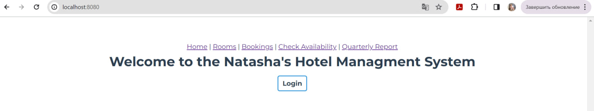
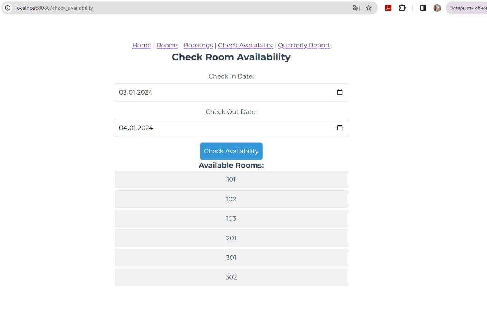

## Компоненты Vue

### Главная страница
Содержит панель для перехода к нужным страницам и кнопку для входа в систему
``` html title="HomePage.vue"
<template>
  <div>
    <h1>Welcome to the Natasha's Hotel Managment System</h1>
    <button @click="goAuth" class="login-button bold-text">
      {{ isAuthenticated ? 'Logout' : 'Login' }}
    </button>
  </div>
</template>

<script>
export default {
  name: 'HomePage',
  data() {
    return {
      isAuthenticated: false, // Изначально пользователь не залогинен
    };
  },
  methods: {
    goAuth() {
      if (this.isAuthenticated) {
        // Если пользователь залогинен, то делаем logout
        localStorage.removeItem('access_token');
        this.isAuthenticated = false;
      } else {
        // Если пользователь не залогинен, то переходим на страницу login
        this.$router.push({ name: 'login' });
      }
    },
  },
  created() {
    // Проверяем, есть ли токен в localStorage при создании компонента
    const accessToken = localStorage.getItem('access_token');
    this.isAuthenticated = !!accessToken;
  },
};
</script>

<style>
.bold-text {
  font-weight: bold;
}

.login-button {
  border: 2px solid #3498db; /* Цвет обводки кнопки */
  border-radius: 5px; /* Закругление углов */
  padding: 5px 10px; /* Внутренний отступ кнопки */
  margin: 10px; /* Внешний отступ кнопки */
  cursor: pointer; /* Задаем курсор */
  transition: background-color 0.3s; /* Плавный переход цвета фона */
}

.login-button:hover {
  background-color: #3498db; /* Изменяем цвет фона при наведении */
  color: #ffffff; /* Изменяем цвет текста при наведении */
}
</style>

```


### Вход в систему
``` html title="LoginView.vue"
<template>
  <div class="login-container">
    <input v-model="login" type="text" placeholder="Username"/>
    <input v-model="password" type="password" placeholder="Password"/>
    <button @click="setLogin">Login</button>
  </div>
</template>

<script>
import axios from 'axios';

export default {
  name: 'LoginView',
  data() {
    return {
      login: '',
      password: '',
    };
  },
  methods: {
    async setLogin() {
      try {
        const response = await axios.post('http://127.0.0.1:8000/hotel/token/', {
          username: this.login,
          password: this.password,
        });

        // При успешном получении токена сохраняем его в localStorage
        localStorage.setItem('access_token', response.data.access);

        // Перенаправляем на домашнюю страницу
        this.$router.push({ name: 'homepage' });
      } catch (error) {
        console.error(error);

        // При ошибке 401 (неверные учетные данные), выводим сообщение
        if (error.response && error.response.status === 401) {
          alert('Invalid username or password');
        }
      }
    },
  },
};
</script>

<style scoped>
.login-container {
  width: 80%;
  max-width: 400px; /* Ограничиваем максимальную ширину контейнера */
  margin: 0 auto; /* Центрируем контейнер на странице */
  text-align: center;
}

.login-container input {
  width: 100%;
  padding: 10px;
  margin-bottom: 15px;
  box-sizing: border-box;
  border: 1px solid #ccc;
  border-radius: 5px;
}

.login-container button {
  cursor: pointer;
  background-color: #3498db;
  color: #fff;
  border: none;
  padding: 10px;
  border-radius: 5px;
  transition: background-color 0.3s;
}

.login-container button:hover {
  background-color: #1e6ea9;
}
</style>

```


### Список комнат, добавление новой комнаты
``` html title="RoomList.vue"
<template>
  <div class="rooms_container">
    <div class="rooms_content">
      <h1>Rooms</h1>

      <!-- Форма для добавления новой комнаты -->
      <div class="add_room">
        <h2>Add a New Room</h2>
        <form @submit.prevent="addRoom">
          <label for="number">Number:</label>
          <input type="text" v-model="newRoom.number" required />

          <label for="category">Category:</label>
          <select v-model="newRoom.category" required>
            <option value="SINGLE">Single Room</option>
            <option value="DOUBLE">Double Room</option>
            <option value="TRIPLE">Triple Room</option>
          </select>

          <label for="cost">Cost:</label>
          <input type="text" v-model="newRoom.cost" required />

          <label for="phone">Phone:</label>
          <input type="text" v-model="newRoom.phone" required />

          <label for="floor">Floor:</label>
          <!-- Используйте элемент select для выбора этажа -->
          <select v-model="newRoom.floor" required>
            <option v-for="floor in availableFloors" :key="floor.id" :value="floor.id">{{ floor.floor }}</option>
          </select>

          <button type="submit">   Add Room</button>
        </form>
      </div>

      <!-- Список комнат -->
      <ul class="room_list">
        <li v-for="room in rooms" :key="room.id">
          <h2>{{ room.number }}</h2>
          <p>Category: {{ room.category }}</p>
          <p>Cost: {{ room.cost }}</p>
          <p>Phone: {{ room.phone }}</p>
          <p>Floor: {{ room.floor }}</p>
          <button @click="deleteRoom(room)">Delete</button>
        </li>
      </ul>
      <div v-if="rooms.length === 0">No rooms available.</div>
    </div>
  </div>
</template>

<script>
export default {
  data() {
    return {
      rooms: [],
      newRoom: {
        number: "",
        category: "",
        cost: "",
        phone: "",
        floor: null,
      },
      availableFloors: [],
    };
  },
  methods: {
    async getData() {
      try {
        const responseFloors = await this.$http.get('http://127.0.0.1:8000/hotel/floors/');
        this.availableFloors = responseFloors.data;

        const responseRooms = await this.$http.get('http://127.0.0.1:8000/hotel/rooms/');
        this.rooms = responseRooms.data;
      } catch (error) {
        console.error('Error fetching data:', error);
      }
    },
    async addRoom() {
      try {
        const response = await this.$http.post('http://127.0.0.1:8000/hotel/rooms/', {
          ...this.newRoom,
        });

        this.rooms.push(response.data);
        this.newRoom = {
          number: "",
          category: "",
          cost: "",
          phone: "",
          floor: null,
        };
      } catch (error) {
        console.error('Error adding room:', error);
      }
    },
    async deleteRoom(room) {
      let confirmation = confirm("Do you want to delete this room?");

      if (confirmation) {
        try {
          await this.$http.delete(`http://127.0.0.1:8000/hotel/rooms/${room.id}`);

          this.getData();
        } catch (error) {
          console.error('Error deleting room:', error);
        }
      }
    },
  },
  created() {
    this.getData();
  },
};
</script>

<style scoped>
.rooms_container {
  width: 80%;
  margin: 0 auto;
  display: flex;
  flex-direction: column;
  align-items: center;
  justify-content: center;
  min-height: 100vh;
}

.rooms_content {
  text-align: center;
  width: 100%;
}

.add_room form {
  width: 80%;
  max-width: 400px; /* Ограничиваем максимальную ширину формы */
  margin: 0 auto; /* Центрируем форму в родительском контейнере */
  border: 1px solid #ccc;
  padding: 10px;
  border-radius: 5px;
  margin-bottom: 20px;
}

.add_room label {
  display: block;
  margin-bottom: 5px;
}

.add_room select,
.add_room input {
  width: 100%; /* Занимает всю ширину доступного пространства */
  padding: 8px;
  margin-bottom: 10px;
  box-sizing: border-box;
  border: 1px solid #ccc;
  border-radius: 3px;
}

.add_room button[type="submit"] {
  cursor: pointer;
  background-color: #3498db;
  color: #fff;
  border: none;
  padding: 8px 16px;
  border-radius: 3px;
  transition: background-color 0.3s;
}

.add_room button[type="submit"]:hover {
  background-color: #1e6ea9;
}

.room_list {
  list-style-type: none;
  padding: 0;
  width: 100%;
}

.room_list li {
  width: 80%;
  max-width: 400px; /* Ограничиваем максимальную ширину списка комнат */
  align: center;
  padding: 10px;
  margin-bottom: 10px;
  border-radius: 5px;
  margin: 0 auto; /* Центрируем элемент списка в родительском контейнере */
}

.room_list button {
  cursor: pointer;
  background-color: #3498db;
  color: #fff;
  border: none;
  padding: 5px 10px;
  border-radius: 3px;
  transition: background-color 0.3s;
}

.room_list button:hover {
  background-color: #1e6ea9;
}

.room_list p {
  margin: 5px 0;
}

.room_list h2 {
  margin-bottom: 10px;
}

.room_list div {
  margin-top: 20px;
}
</style>

```


### Просмотр всех бронирований, заселение/выселение в конкретном бронировании
``` html title="BookingsList.vue"
<template>
  <div>
    <h2>Booking Management</h2>

    <!-- Отображение всех бронирований -->
    <div>
      <h3>All Bookings</h3>
      <ul>
        <li v-for="booking in bookings" :key="booking.id">
          <p>User: {{ booking.user }}</p>
          <p>Room: {{ booking.room }}</p>
          <p>Check In: {{ booking.check_in }}</p>
          <p>Check Out: {{ booking.check_out }}</p>
          <p>Check In Done: {{ booking.check_in_done }}</p>
          <p>Check Out Done: {{ booking.check_out_done }}</p>

          <!-- Галочки для check-in и check-out -->
          <label>
            Check In
            <input type="checkbox" v-model="booking.check_in_done" @change="updateCheckInOut(booking.id, 'check_in')">
          </label>

          <label>
            Check Out
            <input type="checkbox" v-model="booking.check_out_done" @change="updateCheckInOut(booking.id, 'check_out')">
          </label>
        </li>
      </ul>
    </div>
  </div>
</template>

<script>
export default {
  data() {
    return {
      bookings: [],
    };
  },
  methods: {
    async loadBookings() {
      try {
        const response = await this.$http.get(`http://127.0.0.1:8000/hotel/all_bookings/`);
        this.bookings = response.data;
      } catch (error) {
        console.log(error);
      }
    },
    async updateCheckInOut(bookingId, updateType) {
      try {
        const response = await this.$http.patch(`http://127.0.0.1:8000/hotel/all_bookings/${bookingId}/`, {
          update_type: updateType,
        });

        // Найти индекс обновленной записи в массиве
        const index = this.bookings.findIndex((b) => b.id === bookingId);

        // Обновить массив
        if (index !== -1) {
          this.bookings[index] = response.data;
          this.$forceUpdate(); // Принудительное обновление компонента
        }
      } catch (error) {
        console.log(error);
      }
    },
  },
  created() {
    this.loadBookings();
  },
};
</script>

<style scoped>
/* Ваши стили для компонента (если нужны) */
</style>

```


### Проверка свободных номеров  в указанный промежуток времени
``` html title="AvailabilityCheck.vue"
<template>
  <div class="availability_check">
    <h2>Check Room Availability</h2>
    <form @submit.prevent="checkAvailability">
      <label for="checkInDate">Check In Date:</label>
      <input type="date" v-model="checkInDate" required />

      <label for="checkOutDate">Check Out Date:</label>
      <input type="date" v-model="checkOutDate" required />

      <button type="submit">Check Availability</button>
    </form>

    <!-- Отображение результатов -->
    <div v-if="availableRooms.length > 0">
      <h3>Available Rooms:</h3>
      <ul>
        <li v-for="room in availableRooms" :key="room.id">{{ room.number }}</li>
      </ul>
    </div>
    <div v-else>
      <p>No available rooms for the selected dates.</p>
    </div>
  </div>
</template>

<script>
export default {
  data() {
    return {
      checkInDate: '',
      checkOutDate: '',
      availableRooms: [],
    };
  },
  methods: {
    async checkAvailability() {
      try {
        const response = await this.$http.get(`http://127.0.0.1:8000/hotel/free_rooms/${this.checkInDate}/${this.checkOutDate}/`);

        this.availableRooms = response.data;
      } catch (error) {
        console.log(error);
      }
    },
  },
};
</script>

<style scoped>
.availability_check {
  width: 80%;
  max-width: 600px; /* Ограничиваем максимальную ширину контейнера */
  margin: 0 auto; /* Центрируем контейнер на странице */
  text-align: center;
}

.availability_check form {
  margin-top: 20px;
}

.availability_check label {
  display: block;
  margin-bottom: 5px;
}

.availability_check input {
  width: 100%;
  padding: 10px;
  margin-bottom: 15px;
  box-sizing: border-box;
  border: 1px solid #ccc;
  border-radius: 5px;
}

.availability_check button {
  cursor: pointer;
  background-color: #3498db;
  color: #fff;
  border: none;
  padding: 10px;
  border-radius: 5px;
  transition: background-color 0.3s;
}

.availability_check button:hover {
  background-color: #1e6ea9;
}

.availability_check ul {
  list-style: none;
  padding: 0;
}

.availability_check li {
  background-color: #f1f1f1;
  border: 1px solid #ddd;
  padding: 10px;
  margin-bottom: 5px;
  border-radius: 5px;
}
</style>


```


### Квартальный отчет
``` html title="QuerterlyReport.vue"
<template>
  <div class="quarterly-report">
    <h2>Generate Quarterly Report</h2>
    <form @submit.prevent="generateReport">
      <label for="quarter">Select Quarter:</label>
      <select v-model="selectedQuarter" required>
        <option value="1">1</option>
        <option value="2">2</option>
        <option value="3">3</option>
        <option value="4">4</option>
      </select>

      <label for="year">Enter Year:</label>
      <input type="number" v-model="selectedYear" required />

      <button type="submit">Generate Report</button>
    </form>

    <!-- Отображение результатов -->
    <div v-if="reportData">
      <h3>Quarterly Report</h3>

      <!-- Отображение room_client_reports -->
      <div v-if="reportData.room_client_reports.length > 0">
        <h4>Room Client Reports</h4>
        <ul>
          <li v-for="(report, index) in reportData.room_client_reports" :key="index">
            Room {{ report.room__number }}: {{ report.num_clients }} clients
          </li>
        </ul>
      </div>

      <!-- Отображение floor_reports -->
      <div v-if="reportData.floor_reports.length > 0">
        <h4>Floor Reports</h4>
        <ul>
          <li v-for="(report, index) in reportData.floor_reports" :key="index">
            Floor {{ report.floor }}: {{ report.num_rooms }} rooms
          </li>
        </ul>
      </div>

      <!-- Отображение total_income_for_room -->
      <div v-if="reportData.total_income_for_room.length > 0">
        <h4>Total Income for Each Room</h4>
        <ul>
          <li v-for="(report, index) in reportData.total_income_for_room" :key="index">
            Room {{ report.room__number }}: {{ report.total_income_for_room }}
          </li>
        </ul>
      </div>

      <!-- Отображение total_income_for_hotel -->
      <div v-if="reportData.total_income_for_hotel !== null">
        <h4>Total Income for Hotel</h4>
        <p>{{ reportData.total_income_for_hotel }}</p>
      </div>
    </div>
    <div v-else>
      <p>No report generated yet.</p>
    </div>
  </div>
</template>

<script>
export default {
  data() {
    return {
      selectedQuarter: '',
      selectedYear: '',
      reportData: null,
    };
  },
  methods: {
    async generateReport() {
      try {
        const response = await this.$http.get(`http://127.0.0.1:8000/hotel/quarterly_report/${this.selectedQuarter}/${this.selectedYear}/`);
        this.reportData = response.data;
      } catch (error) {
        console.log(error);
      }
    },
  },
};
</script>

<style scoped>
.quarterly-report {
  width: 80%;
  margin: 0 auto;
  text-align: center;
}

.quarterly-report form {
  margin-bottom: 20px;
}

.quarterly-report label {
  display: block;
  margin-bottom: 5px;
}

.quarterly-report select,
.quarterly-report input {
  width: calc(100% - 12px);
  padding: 8px;
  margin-bottom: 10px;
  box-sizing: border-box;
  border: 1px solid #ccc;
  border-radius: 3px;
}

.quarterly-report button[type="submit"] {
  cursor: pointer;
  background-color: #3498db;
  color: #fff;
  border: none;
  padding: 8px 16px;
  border-radius: 3px;
  transition: background-color 0.3s;
}

.quarterly-report button[type="submit"]:hover {
  background-color: #1e6ea9;
}

.quarterly-report h3,
.quarterly-report h4 {
  margin-top: 20px;
}
</style>

```


### Компонент App
``` html title="App.vue"
<template>
  <div id="app">
    <nav>
      <router-link to="/">Home</router-link> |
      <router-link to="/rooms">Rooms</router-link> |
      <router-link to="/bookings">Bookings</router-link> |
      <router-link to="/check_availability">Check Availability</router-link> |
      <router-link to="/quarterly_report">Quarterly Report</router-link>


    </nav>
    <router-view />
  </div>
</template>

<script>
export default {
  name: "App",
};
</script>

<style>
#app {
  font-family: Montserrat;
  -webkit-font-smoothing: antialiased;
  -moz-osx-font-smoothing: grayscale;
  text-align: center;
  color: #2c3e50;
  margin-top: 60px;
}

#button
nav {
  margin-bottom: 20px;
}
</style>

```

### main.js
``` js title="main.js"
import { createApp } from 'vue';
import App from './App.vue';
import axios from 'axios';
import { createRouter, createWebHistory } from 'vue-router';
import HomePage from './components/HomePage.vue';
import RoomList from './components/RoomList.vue';
import AvailabilityCheck from './components/AvailabilityCheck.vue';
import QuarterlyReport from './components/QuarterlyReport.vue';
import BookingsList from './components/BookingsList.vue';
import LoginView from './components/LoginView.vue';

import Vuetify from 'vuetify';  // Добавьте эту строку
import 'vuetify/dist/vuetify.min.css';  // И эту строку для подключения стилей


const app = createApp(App);

const router = createRouter({
  history: createWebHistory(),
  routes: [
    { path: '/', name: "homepage", component: HomePage },
    { path: '/login', name: "login", component: LoginView },
    { path: '/rooms', component: RoomList, name: 'RoomList', meta: { requiresAuth: true } },
    { path: '/check_availability', component: AvailabilityCheck, meta: { requiresAuth: true } },
    { path: '/quarterly_report', component: QuarterlyReport, meta: { requiresAuth: true } },
    { path: '/bookings', component: BookingsList, meta: { requiresAuth: true } },

  ],
});

router.beforeEach((to, from, next) => {
  const isAuthenticated = localStorage.getItem('access_token');

  if (to.matched.some(record => record.meta.requiresAuth) && !isAuthenticated) {
    // Если маршрут требует аутентификации и пользователь не аутентифицирован,
    // вывести предупреждение и перенаправить на главную страницу
    alert('Please login');
    next('/');
  } else {
    // В противном случае продолжите нормальное выполнение навигации
    next();
  }
});

app.use(router);

app.config.globalProperties.$http = axios;


app.use(Vuetify);

app.mount('#app');

```
